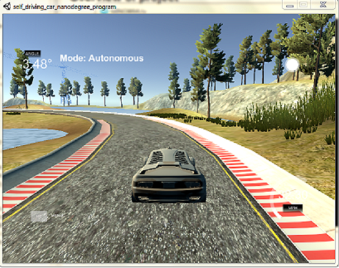
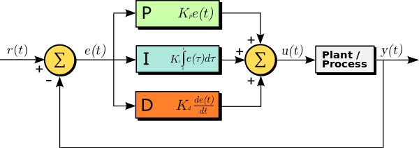
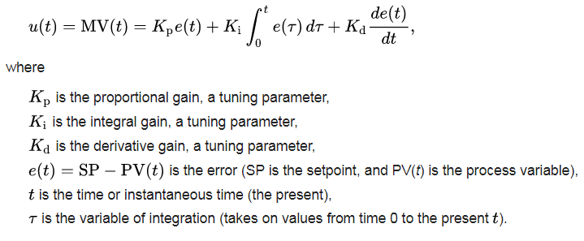
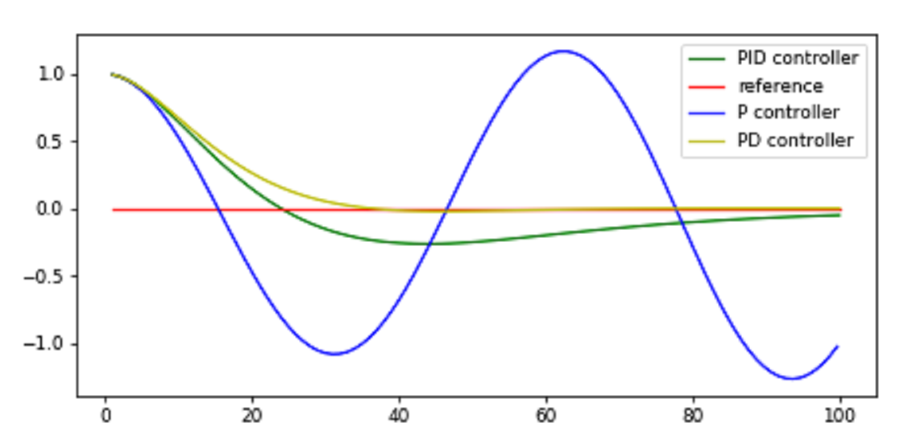

# CarND-Controls-PID

# Project Goals
---
The goal of this project are the following:

* Implement a PID controller which controls steering angle (and additionally throttle if possible) to keep the vehicle in udacity simulator within lane bound.
* Tune Kp,Ki,Kd gains (using twiddle).
* Summarize the results with a written report.

 

* PID in Action *

### Rubric points
Student describes the effect of the P, I, D component of the PID algorithm in their implementation. Is it what you expected?

Visual aids are encouraged, i.e. record of a small video of the car in the simulator and describe what each component is set to.

Student discusses how they chose the final hyperparameters (P, I, D coefficients). This could be have been done through manual tuning, twiddle, SGD, or something else, or a combination!

# Overview of project
---
## PID Controller [wikipedia](https://en.wikipedia.org/wiki/PID_controller)

A proportional–integral–derivative controller (PID controller or three term controller) is a control loop feedback mechanism widely used in industrial control systems and a variety of other applications requiring continuously modulated control. A PID controller continuously calculates an error value e(t) (called cross track error, cte in this project) as the difference between a desired setpoint (SP) and a measured process variable (PV) and applies a correction based on proportional, integral, and derivative terms (denoted P, I, and D respectively) which give the controller its name.

In practical terms it automatically applies accurate and responsive correction to a control function. An everyday example is the cruise control on a road vehicle; where external influences such as gradients would cause speed changes, and the driver has the ability to alter the desired set speed. The PID algorithm restores the actual speed to the desired speed in the optimum way, without delay or overshoot, by controlling the power output of the vehicle's engine.

 

*PID controller in a System*

The PID control scheme is named after its three correcting terms, whose sum constitutes the manipulated variable (MV). The proportional, integral, and derivative terms are summed to calculate the output of the PID controller. Defining  u(t) as the controller output, the final form of the PID algorithm is

 

### P in PID - Proportional term
The proportional term produces an output value that is proportional to the current error value. The proportional response can be adjusted by multiplying the error by the proportional gain constant.
A high proportional gain results in a large change in the output for a given change in the error. If the proportional gain is too high, the system can become unstable. In contrast, a small gain results in a small output response to a large input error, and a less responsive or less sensitive controller. If the proportional gain is too low, the control action may be too small when responding to system disturbances. 

The the current project, implementing P only (Kp), the vehicle oscillates generating high cte and then overcompensating with steering correction as seen in image below:
 

Proportional control alone results in a marginally stable system.

### I In PID - Integral term
The contribution from the integral term is proportional to both the magnitude of the error and the duration of the error. The integral in a PID controller is the sum of the instantaneous error over time and gives the accumulated offset that should have been corrected previously.
The integral term accelerates the movement of the process towards setpoint and eliminates the residual steady-state error that occurs with a pure proportional controller. However, since the integral term responds to accumulated errors from the past, it can cause the present value to overshoot the setpoint value.The integral gain helps the controller to deal with the systematic bias problem witch leads to a systematic error

The the current project, implementing P and I (Kp,Ki), the vehicle overshoots the lane marking as seen in image below:
 

### D in PID - Derivative term
The derivative of the process error is calculated by determining the slope of the error over time and multiplying this rate of change by the derivative gain Kd.Derivative action predicts system behavior and thus improves settling time and stability of the system. 

The derivative gain complements the proportional output by reducing the overshoot, it smoothens the vehicles movements as seen in the image below:

Here is a plot of the above components in the robot example from Sebastian's PID lecture.

 

### In this project, PID controller is implemented in C++ to control steering angle of the vehicle in simulator such that it stays within drivable surface.

The PID gain parameters (Kp,Ki,Kd) has been tuned using **Twiddle** method as described in Sebastian's lecture. Here is the twiddle algorithm:
 
 

Twiddle is a general purpose algorithm that tries to find a good choice of parameters 
for an algorithm that returns an error. It is similar in concept to gradient descent.

# PID Tunning
---
Twiddle algorithm is implemented to tune the PID gain parameters. Multiple parameter sets were found in different configuration which came close to project goal of keeping the vehicle within drivable bounds. Some additional manual tuning were applied on top of twiddle generated parameters to smoothen vehicle steering at some corners (specifically last turn).
In this implementation twiddle parameters p can be set at 0 or values can be specified as starting point for faster optimization.

Few twiddle loops took over 150 loops and seemed to be stuck in local minima.
Besides, the simulator behavior has been found to be a bit random and a twiddle implementation  that had converged earlier didn't converge in next run.

In almost all the runs where twiddle converged, Ki value was very close to 0 (0.01).
Final value chosen for submission is:

| Kp       | Ki       | Kd      |
| :---:    | :---:    | :---:   | 
| 0.134587 | 0.0      | 3.05298 | 

# Result
---

Following image is the result of running simulator with the project submission  code.

 

There is a hint in the project code to try PID for throttle control as well.In this implementation throttle is set at 0.3, this can be an improvement in future.
*Feel free to play around with the throttle and speed. Maybe use another PID controller to control the speed!*

# Source Code Files
--- 

The source code of this project is available at [github]( https://github.com/atul799/CarND-Controls-PID/src)
To compile and run the PID code (non-twiddle mode), following steps are required:

1. cd build
2. cmake ..
3. make
4. ./pid
5. open unity Simulator, choose data and run

For twiddle tuning of parameters, the run command shall be:
1. with p vector initialized as 0
./pid 1 
2. provide initial guess for p vector
./pid 1 <init_kp_guess> <init_ki_guess> <init_kd_guess>
 

*This project requires the following tools/packages to work:
1. [Udacity Simulator](https://github.com/udacity/self-driving-car-sim/releases/)
2. uWebSocketIO;

